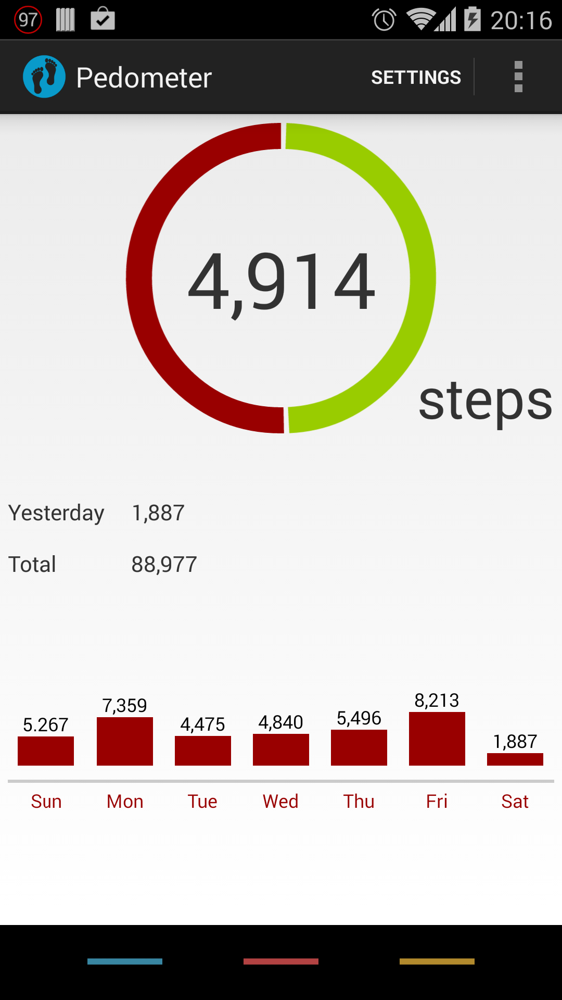

Pedometer
=========

A fork of jvelin's open source [Pedometer app](https://github.com/j4velin/Pedometer).

<b>Modifications</b>
1. A new Step History Fragment, in which you can view your step data per day, week and month
2. Sorting Step History by Steps, Date, Steps on your Best Day, Standard Deviation between days
3. Calculated calorie counts based on height, weight and step length
4. Moved Split Count from a Dialog Box to an actual Fragment
5. A Nav Bar
6. Moved Google Play logic into the main branch

<b>Description</b>

Lightweight pedometer app using the <b>hardware step-sensor</b> for minimal battery consumption.
This app is designed to be kept running all the time without having any impact on your battery life! It uses the hardware step detection sensor of the Nexus 5, which is already running even when not using any pedometer app. Therefore the app does not drain any additional battery. Unlike other pedometer apps, this app does <b>not</b> track your movement or your location so it doesn't need to turn on your GPS sensor (again: <b>no impact on your battery</b>).
